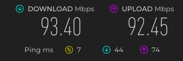

# RTL8821CE-macOS

Native Wi-Fi for **Realtek RTL8821CE** (and the rest of the rtw88 PCIe family)
on Hackintosh. The card works like a real Mac's AirPort card: it appears in the
Wi-Fi menu and System Settings, remembers networks, auto-joins and reconnects
after sleep. You don't need a client app, and SIP stays enabled.

Driver: **AirPort_RTW88 2.0.1**, daily-driven on macOS Sonoma 14.8.9.

> [!WARNING]
> This is an experimental kernel extension, tested on one laptop with one
> router. Keep a bootable copy of your current EFI on a USB stick before you
> change anything.

---

## Before and after

<p align="center">
  <br>
  <b>🏆 RTL8821CE on macOS Sonoma: 93.4 Mbps down / 92.5 Mbps up, 7 ms ping. Full line speed over Wi-Fi.</b>
</p>

| | Before (AirPort_RTW88 2.0.0) | After (2.0.1, this repo) |
|---|---|---|
| **Connection** | Kept dropping and reconnecting | Stays connected |
| **Download (5 GHz)** | 7.2 Mbps | **92.1 Mbps** (~13× faster) |
| **Upload (5 GHz)** | 20.7 Mbps | **98.6 Mbps** (~5× faster) |
| **2.4 GHz** | not measured | 41.7 Mbps down / 58.2 Mbps up |
| **Responsiveness under load** | 1.9–2.5 s delays, ~25% of pings lost | ~5 ms, no loss |
| **Sleep / wake** | not measured | Reconnects on its own in ~3 seconds |

Measured with macOS `networkQuality` on a 100 Mbps internet line. Ethernet on
the same line measured 82.7 down / 96.3 up, so Wi-Fi now runs at full line
speed.

---

## Supported Wi-Fi chips

PCIe cards only. USB and SDIO Realtek adapters are **not** supported.

| Chip | PCI ID | Status |
|---|---|---|
| **RTL8821CE** | `10ec:c821`, `10ec:b821` | ✅ Tested, daily driver |
| RTL8822BE | `10ec:b822` | ⚠️ Supported by the kext (firmware included), untested |
| RTL8822CE | `10ec:c822`, `10ec:c82f` | ⚠️ Supported by the kext (firmware included), untested |

**Find your card's ID:** on macOS, look at Hackintool → **PCIe**, or run
`ioreg -l | grep -iE '"vendor-id"|"device-id"'`. On Windows, use Device
Manager → Hardware IDs. On Linux, use `lspci -nn`. Realtek's vendor ID is
`10ec`.

## Supported macOS versions

| macOS | Status |
|---|---|
| **Sonoma 14.8.9** | ✅ Tested, daily driver |
| Sonoma 14.4 and later | ⚠️ Should work with this guide, untested |
| Sequoia 15 / Tahoe 26 | ⚠️ Same kext setup as Sonoma, untested |
| Ventura 13.7.7 – 13.7.8 | ⚠️ Use only `AirPort_RTW88.kext` (skip the other three kexts and the Block entry), untested |
| Monterey 12 and older | ❌ Not supported |

---

## What works

- WPA2-Personal (AES)
- WPA3/WPA2 **transition** mode (connects as WPA2)
- Open networks
- 2.4 GHz and 5 GHz (80 MHz on 5 GHz)
- Wi-Fi menu, signal strength, joining, saved networks, auto-join, switching networks
- Router key changes (group rekeys) without disconnects
- Sleep/wake (lid and Apple menu → Sleep), with automatic reconnect
- SIP enabled; no root patching

## What doesn't work

- ❌ WPA3-only (SAE) networks
- ❌ WPA2/WPA3 Enterprise (work/school logins)
- ❌ Joining hidden networks
- ❌ AirDrop, Continuity, Sidecar, Handoff (AWDL)
- ❌ Bluetooth (a separate USB device on these cards; not covered here)
- ❔ WPA2 with TKIP is untested

## Known issues

- **Cosmetic "hidden network" label.** After some wakes or network switches,
  macOS marks the connected network as "hidden" in its saved profile. The
  connection itself is unaffected, and a later join clears the label.
- **2.4 GHz full-speed upload.** The driver briefly throttles sending. This is
  flow control, not a freeze.

---

## Setup guide (OpenCore, macOS Sonoma)

### What you need

- A working OpenCore EFI that already boots macOS and loads **Lilu.kext**
- [ProperTree](https://github.com/corpnewt/ProperTree) to edit `config.plist`
- This repository: **Code → Download ZIP**

### Step 1: back up your EFI

Copy your whole `EFI` folder to a USB stick, and check that you can boot from
it. If anything goes wrong, boot from the stick and copy the folder back.

### Step 2: copy the kexts

Copy these four folders from [`Kexts/`](Kexts) into `EFI/OC/Kexts/`:

| Kext | Version | What it does |
|---|---|---|
| `AMFIPass.kext` | 1.4.1 | Lets the Wi-Fi kexts load with SIP enabled |
| `IOSkywalkFamily.kext` | 1.0 | Older Apple networking stack needed by the legacy Wi-Fi family |
| `IO80211FamilyLegacy.kext` | 1200.12.2b1 | Legacy Apple Wi-Fi family the driver plugs into |
| `AirPort_RTW88.kext` | **2.0.1** | The Realtek driver (firmware is built in) |

Disable any other Wi-Fi kexts you were using (itlwm, AirportItlwm, Broadcom
patches).

### Step 3: `Kernel → Add`

Add the four kexts **after Lilu**, in exactly this order:

| # | BundlePath | ExecutablePath | PlistPath |
|---|---|---|---|
| 1 | `AMFIPass.kext` | `Contents/MacOS/AMFIPass` | `Contents/Info.plist` |
| 2 | `IOSkywalkFamily.kext` | `Contents/MacOS/IOSkywalkFamily` | `Contents/Info.plist` |
| 3 | `IO80211FamilyLegacy.kext` | `Contents/MacOS/IO80211FamilyLegacy` | `Contents/Info.plist` |
| 4 | `AirPort_RTW88.kext` | `Contents/MacOS/AirPort_RTW88` | `Contents/Info.plist` |

For every entry, set `Arch = Any`, `MinKernel = 23.0.0`, leave `MaxKernel`
empty, and set `Enabled = True`.

> [!IMPORTANT]
> `IO80211FamilyLegacy.kext` contains an `AirPortBrcmNIC.kext` plugin. **Do
> not add it**, because it is only for Broadcom cards. ProperTree's OC Snapshot
> adds it automatically, so delete that entry afterwards.

### Step 4: `Kernel → Block`

Add one entry:

| Key | Value |
|---|---|
| Identifier | `com.apple.iokit.IOSkywalkFamily` |
| Strategy | `Exclude` |
| MinKernel | `23.0.0` |
| MaxKernel | *(empty)* |
| Arch | `Any` |
| Enabled | `True` |

Without this block, macOS loads its own networking stack and Wi-Fi won't
appear.

**Shortcut:** [`docs/opencore-wifi-snippet.plist`](docs/opencore-wifi-snippet.plist)
contains steps 3 and 4 ready to copy into ProperTree.

### Step 5: security settings

- `Misc → Security → SecureBootModel` = `Disabled`
- SIP can stay **enabled** (`csr-active-config` = `00000000`)
- No extra boot-args are needed

### Step 6: validate and reboot

1. Save `config.plist` and run OpenCore's `ocvalidate` on it. It should report
   no issues.
2. Reboot into macOS.
3. Open the Wi-Fi menu, pick your network and enter the password.

### Step 7: check it loaded

```sh
kextstat | grep -E 'rtw88|IO80211FamilyLegacy|IOSkywalk|AMFIPass'
```

You should see `com.rtw88.airport (2.0.1)` plus the other three. Wi-Fi shows
as connected under **System Settings → Network**.

### Recommended for laptops

If closing the lid only locks the screen, or the sleep light stops blinking,
turn off Power Nap and its related features. These are macOS dark wakes, not
the Wi-Fi driver:

```sh
sudo pmset -a powernap 0 proximitywake 0 standby 0 hibernatemode 0
```

---

## Troubleshooting

| Problem | What to check |
|---|---|
| No Wi-Fi at all | The `Kernel → Block` entry exists and is enabled; all four kexts are enabled, in order, with `MinKernel 23.0.0`; run the step 7 command |
| Panic or boot stops after adding the kexts | Boot from your backup USB. Make sure `AirPortBrcmNIC.kext` is **not** in `Kernel → Add` and `SecureBootModel` is `Disabled` |
| Networks appear but joining fails | WPA3-only, Enterprise and hidden networks aren't supported. Set the router to WPA2-Personal (AES) or WPA2/WPA3 mixed mode |
| Need the driver log | `ioreg -l -w0 \| grep DiagnosticLog` (contains no passwords or traffic) |

---

## Building from source

The complete driver source is in [`driver/`](driver). You need Xcode or the
Xcode Command Line Tools, and `python3`.

```sh
cd driver/Feixiao
make airport
```

The kext is written to `driver/Feixiao/build/out/AirPort_RTW88.kext`. The
Realtek firmware in `driver/Feixiao/firmware/` is compressed into the kext
during the build. Use `make airport` only: on Sonoma the kext must be loaded
by OpenCore, not with `make install` or `make load`.

Main changes from 2.0.0:

- **WPA2:** correct handshake retries and key installation, plus group rekeys.
  This fixes the constant disconnects.
- **Speed:** the router's high-speed (HT/VHT) capabilities are read and used.
  This took 5 GHz from about 7 Mbps to line rate.
- **Stability:** memory-safety fixes (buffer overrun, firmware bounds checks,
  station lifetime).
- **macOS integration:** correct disconnect reasons (no auto-join loops after
  manual joins or sleep), Sonoma-format network info, SSIDs kept in scan
  results.
- **Security:** undecrypted or plaintext frames on a protected link are
  dropped, and the FragAttacks A-MSDU check is added.
- **Diagnostics:** a built-in log readable via `ioreg` (`DiagnosticLog`).

---

## Help test and develop

This repo is the baseline for RTL8821CE / rtw88 Wi-Fi on macOS. Reports and
pull requests are welcome, especially for:

- **RTL8822BE / RTL8822CE** cards
- **Sequoia and Tahoe**
- Other routers and security modes
- Open items: WPA3-only (SAE), Enterprise, hidden networks, and the
  "hidden network" label

When you open an issue, include your **chip and PCI ID**, **laptop/board**,
**macOS version**, **router security mode and band**, what works and what
doesn't (including sleep/wake), and the step 7 output.

## Test machine

HP 15-da0003tu (i3-8130U, UHD 620), SMBIOS `MacBookPro14,1`, OpenCore 1.0.7,
macOS Sonoma 14.8.9 (23J631), RTL8821CE, WPA2/WPA3 mixed-mode router.

## Related repositories

- https://github.com/xnoah222/Realtek-AirPort-Family
- https://github.com/thegwchr/Feixiao
- https://github.com/thegwchr/rtw88-stable
